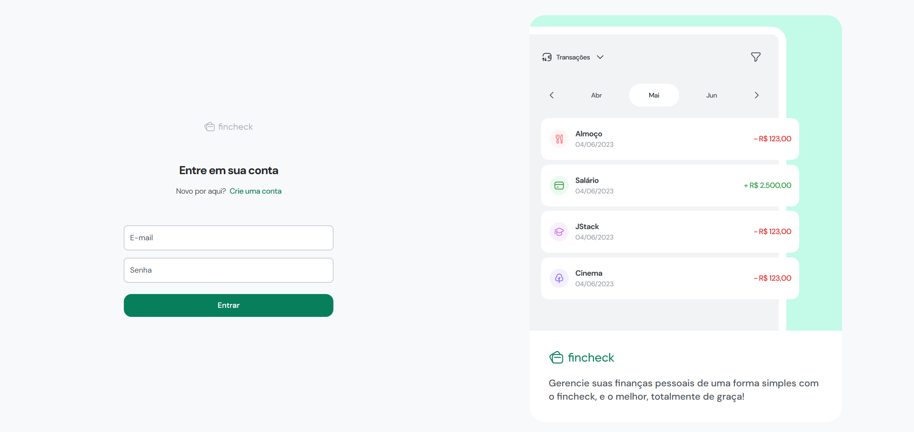
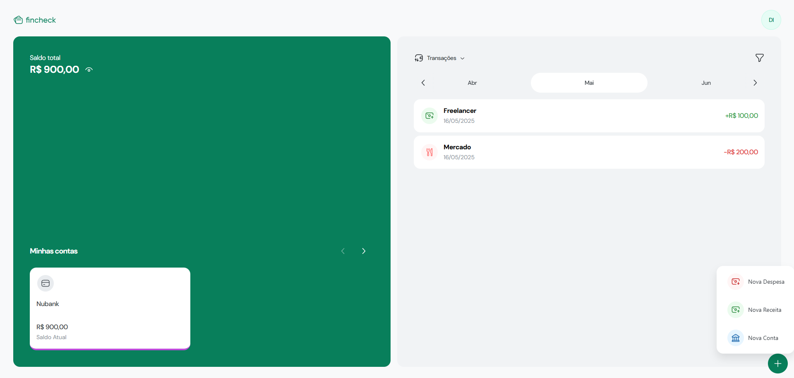

<h1 align="center"> Fincheck </h1>

  <a href="#-tecnologias">Tecnologias</a>&nbsp;&nbsp;&nbsp;|&nbsp;&nbsp;&nbsp;
  <a href="#-projeto">Projeto</a>&nbsp;&nbsp;&nbsp;|&nbsp;&nbsp;&nbsp;
  <a href="#-layout">Layout</a>&nbsp;&nbsp;&nbsp;|&nbsp;&nbsp;&nbsp;
  <a href="#memo-licença">Licença</a>

  

 

  

  

## 🚀 Tecnologias
 
Esse projeto foi desenvolvido com as seguintes tecnologias:

- HTML e CSS
- [TypeScript](https://www.typescriptlang.org/)
- [React](https://react.dev/)
- [JWT](https://articles.wesionary.team/react-hook-form-schema-validation-using-zod-80d406e22cd8)
- [Node.js](https://nodejs.org/pt)
- [NestJS](https://nestjs.com/)
- [Prisma](https://www.prisma.io/)
- [PostgreSQL](https://www.postgresql.org/)

## 💻 Projeto

O fincheck é um aplicativo desenvolvido para ajudar usuários a monitorar suas finanças pessoais de forma fácil e eficiente. O objetivo do projeto é fornecer ferramentas que permitam o controle total sobre contas bancárias, investimentos, despesas, receitas e planejamento financeiro.

## 🔖 Layout

Você pode visualizar o layout do projeto através [DESSE LINK](https://www.figma.com/design/XtTPtXuxALNiDTDOr1HRSP/Fincheck?node-id=229-8335&p=f). É necessário ter conta no [Figma](https://figma.com) para acessá-lo.

## 💜 Contatos

[LinkedIn](https://www.linkedin.com/in/diego-bonze-518225208/)

diegobonze1@gmail.com
